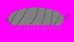

# 🪲 Poly the Isopod - Desktop Pet

Poly is a lightweight, interactive desktop pet built with Python, Pygame, and the Win32 API. He wanders around your screen, eats leaves, and hangs out on top of your windows!



## ✨ Features
* **Always On Top:** Poly walks above your open windows.
* **Pet & Drag:** Click and hold Poly to pick him up and place him anywhere.
* **Persistent Stats:** Saves hunger, health, and position to `poly.json`.

## 🚀 How to Run

### Option 1: Run the Pre-compiled Executable (Windows)
1. Go to the **Releases** tab on the right.
2. Download the latest `poly.zip`.
3. Extract and run `poly.exe`!

### Option 2: Run from Source
```bash
git clone https://github.com/arlopolyisopod-67/poly-desktop-pet.git
cd poly-desktop-pet
pip install pygame-ce
python main.py
```

### Option 3: Compile:
```bash
git clone https://github.com/arlopolyisopod-67/poly-desktop-pet.git
cd poly-desktop-pet
pip install pyinstaller
pyinstaller --noconfirm --onedir --windowed --name "poly" --add-data "...\assets;assets" --add-data "...\utils;utils"  ...\main.py
```
Or if that doesn't work:
```bash
python -m pyinstaller --noconfirm --onedir --windowed --name "poly" --add-data "...\assets;assets" --add-data "...\utils;utils"  main.py
```
